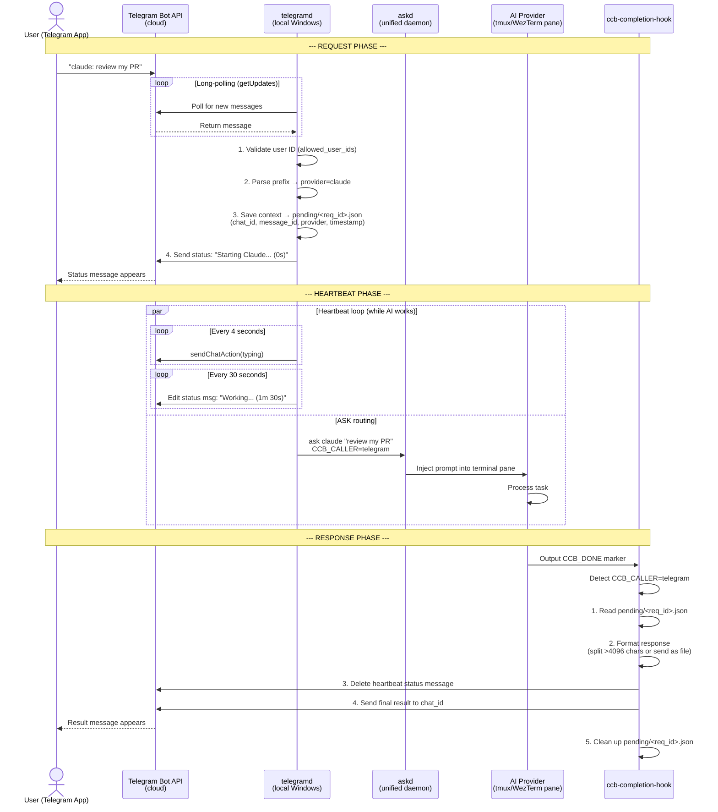

# Telegram Daemon Integration Plan for CCB

> Collaborative design by Claude + Gemini, reviewed by human.
> Created: 2026-03-04

---

## 1. Context & Motivation

The user wants to control CCB (Claude Code Bridge) remotely via Telegram from
their phone. The workflow:

1. Manually start CCB on Windows 11 machine, pointing to a repo
2. Walk away from the computer
3. Monitor ongoing LLM conversations via Telegram
4. Provide input to any AI provider via Telegram
5. Receive completed results via Telegram

---

## 2. Existing Architecture (What We're Building On)

### Relevant Existing Systems

| System | Location | Pattern |
|--------|----------|---------|
| **Email daemon** | `lib/mail/`, `bin/maild` | IMAP polling -> parse -> `ask <provider>` -> completion hook -> SMTP reply |
| **Web interface** | `lib/web/`, `bin/ccb-web` | FastAPI + WebSocket, daemon status, mail config |
| **ASK system** | `lib/askd/`, `bin/ask`, `bin/askd` | Unified TCP JSON-RPC daemon, per-provider adapters |
| **Completion hook** | `bin/ccb-completion-hook`, `lib/completion_hook.py` | Routes replies based on `CCB_CALLER` env var |
| **CCB Protocol** | `lib/ccb_protocol.py` | `CCB_REQ_ID`, `CCB_BEGIN`, `CCB_DONE` markers |
| **Terminal backends** | `lib/terminal.py` | Tmux + WezTerm abstraction for pane injection/tailing |

### Key Extension Point

The `CCB_CALLER` environment variable is the generic mechanism for routing
completion hook responses to different channels. Adding `CCB_CALLER=telegram`
is the natural extension point — the completion hook already has branching
logic for `email` callers.

---

## 3. Decisions Made

### 3.1 Connectivity: Long-Polling (not webhook)

**Decision:** Use direct long-polling via `python-telegram-bot` library.

**Reasoning (Claude + Gemini unanimous):**

| Factor | Long-polling | Webhook (via n8n) |
|--------|-------------|-------------------|
| Setup complexity | Low — just bot token | Higher — n8n workflow + tunnel to local machine |
| Offline handling | **Excellent** — Telegram buffers 24h; daemon catches up on start | Requires custom retry/queue in n8n or messages lost |
| Connectivity | Outbound only — no open ports, works behind NAT | Inbound required — must expose local endpoint |
| Latency | Sub-second | Extra hop adds variable overhead |
| Reliability | Fewer moving parts | Depends on n8n + tunnel + CCB availability |
| Maintenance | All logic in CCB codebase | Must maintain n8n workflow separately |
| Security | No inbound attack surface | Exposes tunnel to local machine |

**The deciding factor:** The "manual start" workflow. User sends a Telegram
message while PC is off. With long-polling, `telegramd` fetches buffered
messages on startup. With webhooks, the message hits n8n immediately and fails
unless custom retry logic exists.

**n8n noted as potential future enhancement:** Could provide "message queued,
machine offline" acknowledgments, but adds distributed state complexity
(duplicate execution risk, race conditions). Not needed for v1.

### 3.2 User Input Flow: Explicit Prefix Always

**Decision:** Always require `provider: message` format (e.g., `claude: review my PR`).

**Reasoning:** Claude raised concern that a "sticky provider" model (Gemini's
suggestion) could lead to confusion — user forgets which provider is active and
sends input to the wrong AI. Explicit prefix is more predictable and safer.
Human agreed with Claude's reasoning.

**Rejected alternative:** Sticky provider with auto-switching on prefixed
messages. Gemini proposed tracking `active_provider` per chat, with visual
feedback ("Sending to Claude..."). Rejected for v1 due to confusion risk.

### 3.3 Output Delivery: Full Output When Complete

**Decision:** Wait for AI to finish, then send complete result. Show typing
indicator + self-editing status message while waiting.

**Reasoning:** User preference. Avoids flooding Telegram with partial output
chunks. Cleaner chat history.

### 3.4 Typing Indicator: Self-Editing Heartbeat Strategy

**Decision (Claude + Gemini agreed):**

1. User sends `claude: do something`
2. Bot replies with status message: `Status: Starting Claude... (0s)`
3. Bot re-sends `sendChatAction(typing)` every 4 seconds (Telegram's indicator
   expires every 5s)
4. Bot **edits that same status message** every 30 seconds:
   `Status: Claude is working... (1m 30s)`
5. When task completes -> delete status message -> send final result as new message
6. If result > 4096 chars -> send as file attachment

**Why self-editing:** Avoids "still working..." message spam. Keeps chat clean.
Single status message with elapsed time reassures user the machine hasn't frozen.

### 3.5 Inline Keyboard Buttons: v2 (not v1)

**Decision:** v1 ships without interactive buttons. v2 adds them.

**Reasoning:** Buttons (`[Continue]` `[Retry]` `[Logs]`) are great UX but add
significant complexity. Ship v1 fast, iterate.

**Planned v2 buttons:**
- `[ Continue ]` — injects "continue" to the provider
- `[ Retry ]` — re-runs the last request
- `[ Logs ]` — fetches last 50 lines of terminal log

### 3.6 State Persistence: JSON Files

**Decision:** Use JSON files (like the email system's `pending/` directory).

**Reasoning:** Simpler than SQLite, consistent with existing CCB patterns,
sufficient for single-user bot. Gemini suggested SQLite for message-to-request
mapping; Claude argued JSON is adequate for v1. Human chose JSON for simplicity.

**Storage location:** `~/.ccb/telegram/`

### 3.7 Library: python-telegram-bot v20+

**Decision (Claude + Gemini unanimous):**

- Async-native (aligns with CCB's FastAPI/WebSocket direction)
- Stable long-polling with good timeout handling
- Built-in persistence support for bot state
- Well-documented, easy for contributors to maintain

### 3.8 Security

**Decisions (Claude + Gemini unanimous):**

- **User whitelisting:** `allowed_user_ids` list in config. Bot ignores all
  unauthorized Telegram users silently.
- **Bot token storage:** `~/.ccb/telegram/config.json` with restricted file
  permissions (0o600 on Unix, ACL-restricted on Windows)
- **Command sanitization:** Strict parsing of provider prefix and message
  content before routing to ASK system
- **No inbound ports:** Long-polling means zero inbound attack surface

### 3.9 Startup Integration: Config-Driven, Optional

**Decision:** Add `telegram.enabled` flag to CCB config. When user runs `ccb`,
the launcher checks this flag and spawns `telegramd` in background if enabled.
Can also be started independently via `bin/telegramd start`.

---

## 4. Architecture

### 4.1 New Components

```
lib/telegram/
    __init__.py
    daemon.py          # TelegramDaemon — lifecycle management (mirrors mail/daemon.py)
    poller.py          # Long-polling via python-telegram-bot Application
    handler.py         # Parse messages, validate user, route to ASK system
    formatter.py       # Markdown -> Telegram MarkdownV2 converter + message splitting
    monitor.py         # Pane output monitor for heartbeat status updates
    config.py          # Config management (bot token, allowed users, preferences)

bin/telegramd          # CLI entry point: start | stop | status | setup
```

### 4.2 Modified Components

```
bin/ccb-completion-hook     # Add CCB_CALLER=telegram branch
lib/completion_hook.py      # Add telegram reply function
lib/web/routes/             # Add telegram.py route for status/config (v2)
config/                     # Add telegram config template
```

### 4.3 Data Flow



### 4.4 Config File Structure

```json
// ~/.ccb/telegram/config.json
{
  "bot_token": "123456:ABC-DEF...",
  "allowed_user_ids": [123456789],
  "default_provider": "claude",
  "heartbeat_interval_sec": 30,
  "max_message_length": 4096,
  "send_code_as_file": true,
  "code_file_threshold_lines": 30
}
```

---

## 5. Implementation Phases

### Phase 1 — MVP (Core Telegram Bridge)

- `telegramd` daemon with long-polling (`python-telegram-bot` v20+)
- Explicit prefix command parsing (`provider: message`)
- User whitelisting (`allowed_user_ids`)
- Route commands to ASK system via `CCB_CALLER=telegram`
- Completion hook sends reply back to Telegram chat
- Self-editing heartbeat status message (typing indicator + elapsed time)
- Auto-split messages at 4096 chars; send long code as file attachment
- JSON-based pending request tracking (`~/.ccb/telegram/pending/`)
- `bin/telegramd setup` wizard (bot token + user ID configuration)
- `bin/telegramd start|stop|status` lifecycle commands
- Config-driven auto-start from `ccb` launcher

### Phase 2 — Monitoring & UX

- Live pane output streaming to Telegram (opt-in `/monitor <provider>`)
- Verbosity levels (summary mode vs live mode)
- Smart truncation of noisy output (skip progress bars)
- Inline keyboard buttons on task completion (`[Continue]` `[Retry]` `[Logs]`)
- Reply-to-message to continue a specific conversation thread
- Web UI integration for Telegram config page

### Phase 3 — Polish

- Sticky provider mode (optional, off by default)
- Message-to-request mapping for threaded conversations
- `/status` command to show active providers and running tasks
- `/cancel` command to abort a running task
- Notification preferences (mute hours, filter by provider)

---

## 6. Dependencies

- `python-telegram-bot>=20.0` (new pip dependency)
- Telegram Bot Token (user creates via @BotFather)
- User's Telegram user ID (for whitelisting)

---

## 7. Open Questions (for implementation time)

1. Should `telegramd` share the same Python process as `askd`, or run as a
   separate process? (Leaning separate for isolation, like `maild`)
2. How to handle the 24h Telegram buffer on startup — process all queued
   messages or only recent ones? (Suggest: process all, but skip messages
   older than a configurable threshold)
3. Windows-specific: should `telegramd` run as a background process or a
   Windows service? (Suggest: background process for simplicity, matching
   `maild` pattern)
4. Error handling: what if the ASK system is not running when a Telegram
   message arrives? (Suggest: reply with error message to user in Telegram)
